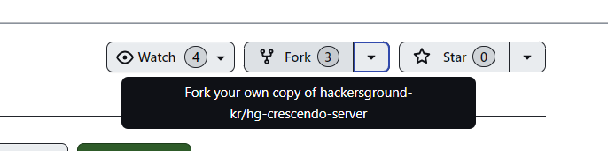
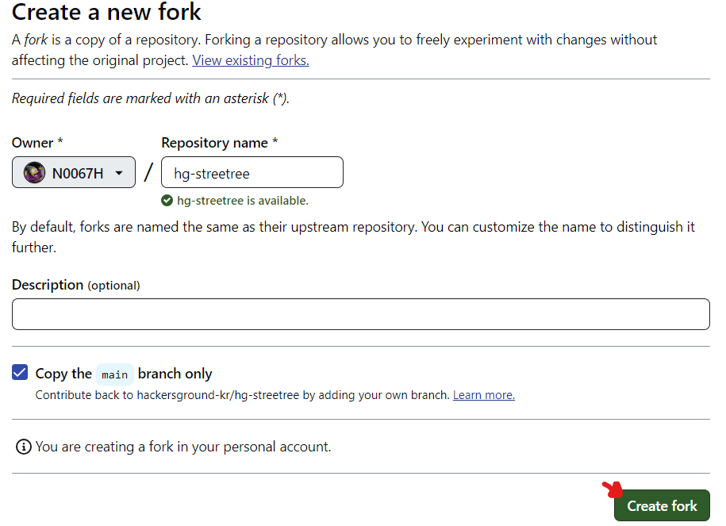
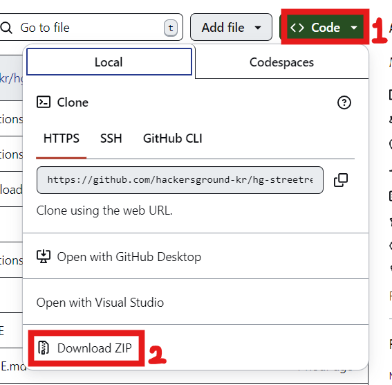

# 가로수 - 농락

해커그라운드 해커톤에 참여하는 가로수 팀의 농락 입니다.

## 참고 문서

> 아래 두 링크는 해커톤에서 앱을 개발하면서 참고할 만한 문서들입니다. 이 문서들에서 언급한 서비스 이외에도 더 많은 서비스들이 PaaS, SaaS, 서버리스 형태로 제공되니 참고하세요.

- [순한맛](./REFERENCES_BASIC.md)
- [매운맛](./REFERENCES_ADVANCED.md)

## 제품/서비스 소개

<!-- 아래 링크는 지우지 마세요 -->
[제품/서비스 소개 보기](TOPIC.md)
<!-- 위 링크는 지우지 마세요 -->

## 오픈 소스 라이센스

<!-- 아래 링크는 지우지 마세요 -->
[오픈소스 라이센스 보기](./LICENSE)
<!-- 위 링크는 지우지 마세요 -->

## 설치 방법

> **아래 제공하는 설치 방법을 통해 심사위원단이 여러분의 제품/서비스를 실제 Microsoft 애저 클라우드에 배포하고 설치할 수 있어야 합니다. 만약 아래 설치 방법대로 따라해서 배포 및 설치가 되지 않을 경우 본선에 진출할 수 없습니다.**

### 사전 준비 사항
- Visual Studio code
- GitHub
    - GitHub Account
    - GitHub CLI
- Azure
    - Azure Account
    - Azure CLI
    - Azure Developer CLI
    - Azure Resource Group
- NodeJS
    - React.js
    - Express.js

## 시작하기
### 환경설정
1. Visual Studio Code 설치
    VS Code 공식 사이트에서 운영체제에 맞는 버전을 다운로드하여 설치합니다.
2. GitHub 설정
    GitHub 계정 생성
    GitHub 공식 사이트에서 계정을 생성합니다.
    GitHub CLI 설치
    GitHub CLI는 명령줄에서 GitHub을 관리할 수 있는 도구입니다. GitHub CLI 설치 페이지에서 설치 방법을 참고하세요.
    설치 후, gh auth login 명령어로 GitHub 계정에 로그인합니다.
3. Azure 설정
    Azure 계정 생성
    Azure 공식 사이트에서 계정을 생성합니다.
    Azure CLI 설치
    Azure CLI 설치 페이지에서 운영체제에 맞는 방법으로 설치합니다.
    설치 후, az login 명령어로 Azure 계정에 로그인합니다.
    Azure Developer CLI 설치
    Azure 개발자 도구를 사용하려면 Azure Developer CLI 설치 페이지에서 설치합니다.
    Azure Resource Group 생성
    Azure CLI를 사용해 자원 그룹을 생성합니다. 예를 들어, az group create --name myResourceGroup --location eastus 명령어를 사용합니다.
4. Node.js 설치 및 React.js, Express.js 설정
    Node.js 설치
    Node.js 공식 사이트에서 최신 LTS 버전을 다운로드하여 설치합니다.
    React.js 프로젝트 생성
    VS Code 터미널에서 다음 명령어를 사용해 React.js 프로젝트를 생성합니다.

Express.js 프로젝트 생성
VS Code 터미널에서 Express.js 프로젝트를 생성합니다.

5. VS Code Extensions 설치
    GitHub: GitHub와 통합된 기능을 제공하는 확장 프로그램입니다.
    Azure Tools: Azure 리소스를 관리할 수 있는 확장 프로그램입니다.
    ESLint: 코드 스타일을 검사하고 정리하는 도구입니다.
    Prettier: 코드 포맷팅 도구입니다.
    VS Code의 확장 프로그램 탭에서 위의 확장 프로그램들을 설치합니다.

6. Git 및 프로젝트 관리
    프로젝트를 GitHub에 올리려면, 터미널에서 다음 명령어를 사용합니다:

이제 VS Code에서 GitHub, Azure, Node.js를 연동하여 개발을 시작할 수 있습니다

Azure CLI 및 GitHub CLI 로그인하기
1-1. Azure Cli설치

Window https://aka.ms/installazurecliwindowsx64
macOS
brew update && brew install azure-cli
Linux
curl -sL https://aka.ms/InstallAzureCLIDeb | sudo bash
1-2. GitHubCLI설치(https://cli.github.com/)

Visual Studio Code에서 아래 명령어를 실행시켜 Azure 및 GitHub에 로그인을 합니다.
# Azure Developer CLI login
azd auth login

# Azure CLI login
az login

# GitHub CLI login
GITHUB_TOKEN=
gh auth login
로그인이 끝났다면 아래 명령어를 통해 제대로 로그인이 되어 있는지 확인합니다.
# Azure Developer CLI
azd auth login --check-status

# Azure CLI
az account show

# GitHub CLI
gh auth status
Azure Developer CLI로 배포 준비하기
아래 명령어를 차례로 실행시켜 배포 환경을 준비합니다.
# bash/zsh
cd $REPOSITORY_ROOT/workshop
AZURE_ENV_NAME="{{ GITHUB_ID }}"
azd init -e $AZURE_ENV_NAME

# PowerShell
cd $REPOSITORY_ROOT/workshop
$AZURE_ENV_NAME = "{{ GITHUB_ID }}"
azd init -e $AZURE_ENV_NAME
중요: {{ GITHUB_ID }}는 자신의 GitHub 아이디로 변경해야 합니다. 예를 들어 GitHub 아이디가 example라면 {{ GITHUB_ID }}를 example로 변경하세요.

Azure Container Apps로 배포하기
아래 명령어를 실행시켜 Aspire 앱을 Azure로 배포합니다.
azd up
어떤 Azure 구독을 사용할 것인지 물어봅니다. 사용할 구독을 hackerground로 선택합니다.
어느 지역에 배포할 것인지 묻습니다. 여기선 Korea Central을 선택합니다.
GitHub Actions로 배포 자동화하기
아래 명령어를 차례로 실행시켜 배포 자동화를 위한 준비를 합니다.
mkdir -p .github/workflows
cd $frontend
아래 명령어를 실행시켜 GitHub Actions 워크플로우를 실행시킬 수 있는 환경을 설정합니다.
azd pipeline config
설정 마지막에 Would you like to commit and push your local changes to start the configured CI pipeline? 라는 질문이 나오면 n를 선택하고 종료합니다.
mac 개발 환경 설정
1. Visual Studio Code 설치
VS Code 공식 사이트에서 macOS용 버전을 다운로드하고 설치합니다.
2. GitHub 설정
GitHub 계정 생성

GitHub 공식 사이트에서 계정을 생성합니다.
Homebrew 설치 (GitHub CLI 설치를 위해 필요)

터미널을 열고 다음 명령어를 입력하여 Homebrew를 설치합니다:
bash
코드 복사
/bin/bash -c "$(curl -fsSL https://raw.githubusercontent.com/Homebrew/install/HEAD/install.sh)"
GitHub CLI 설치

Homebrew를 사용해 GitHub CLI를 설치합니다:

설치 후, gh auth login 명령어로 GitHub 계정에 로그인합니다.
3. Azure 설정
Azure 계정 생성
Azure 공식 사이트에서 계정을 생성합니다.
Azure CLI 설치
Homebrew를 사용해 Azure CLI를 설치합니다:

설치 후, az login 명령어를 사용하여 Azure 계정에 로그인합니다.
Azure Developer CLI 설치
Homebrew를 사용하여 Azure Developer CLI를 설치합니다:

설치 후, azd auth login 명령어를 사용하여 Azure 계정에 로그인합니다.
Azure Resource Group 생성
Azure CLI를 사용하여 자원 그룹을 생성합니다:

4. Node.js 설치 및 React.js, Express.js 설정
Node.js 설치
Homebrew를 사용하여 Node.js를 설치합니다:

React.js 프로젝트 생성
터미널에서 다음 명령어로 React.js 프로젝트를 생성합니다:

Express.js 프로젝트 생성
터미널에서 다음 명령어로 Express.js 프로젝트를 생성합니다:

5. VS Code Extensions 설치
GitHub: GitHub와 통합된 기능을 제공하는 확장 프로그램입니다.
Azure Tools: Azure 리소스를 관리할 수 있는 확장 프로그램입니다.
ESLint: 코드 스타일을 검사하고 정리하는 도구입니다.
Prettier: 코드 포맷팅 도구입니다.
VS Code의 확장 프로그램 탭에서 위의 확장 프로그램들을 설치합니다.

6. Git 및 프로젝트 관리
GitHub에 프로젝트를 올리려면, 터미널에서 다음 명령어를 사용합니다:

### 시작해봅시다
> 먼저 **hackersground-kr/streetree** 저장소를 자신의 GitHub 계정으로 포크해야합니다.
> 
> 우측 상단의 Fork 버튼을 눌러주세요.

> 
> 이후 초록색 Create Fork 버튼을 눌러 포크할 수 있습니다.

> 포크된 저장소로 이동한 후
> 
> 
