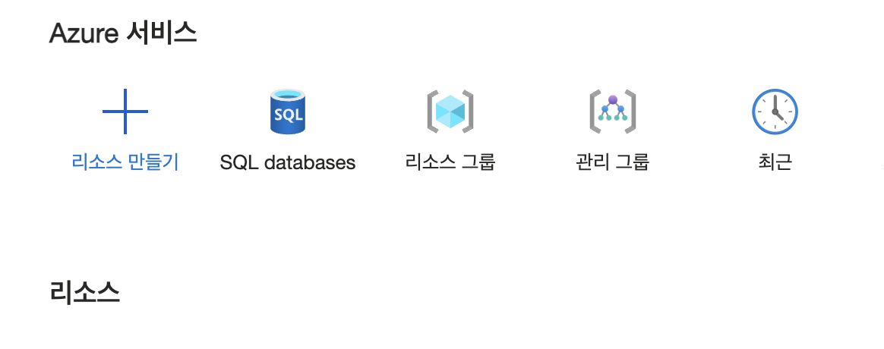
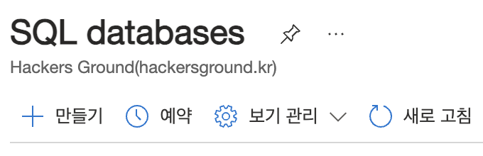
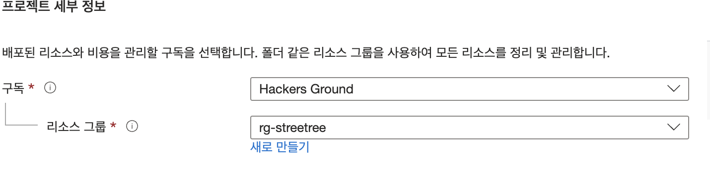
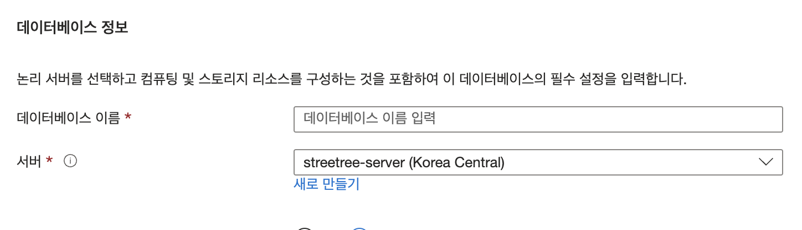
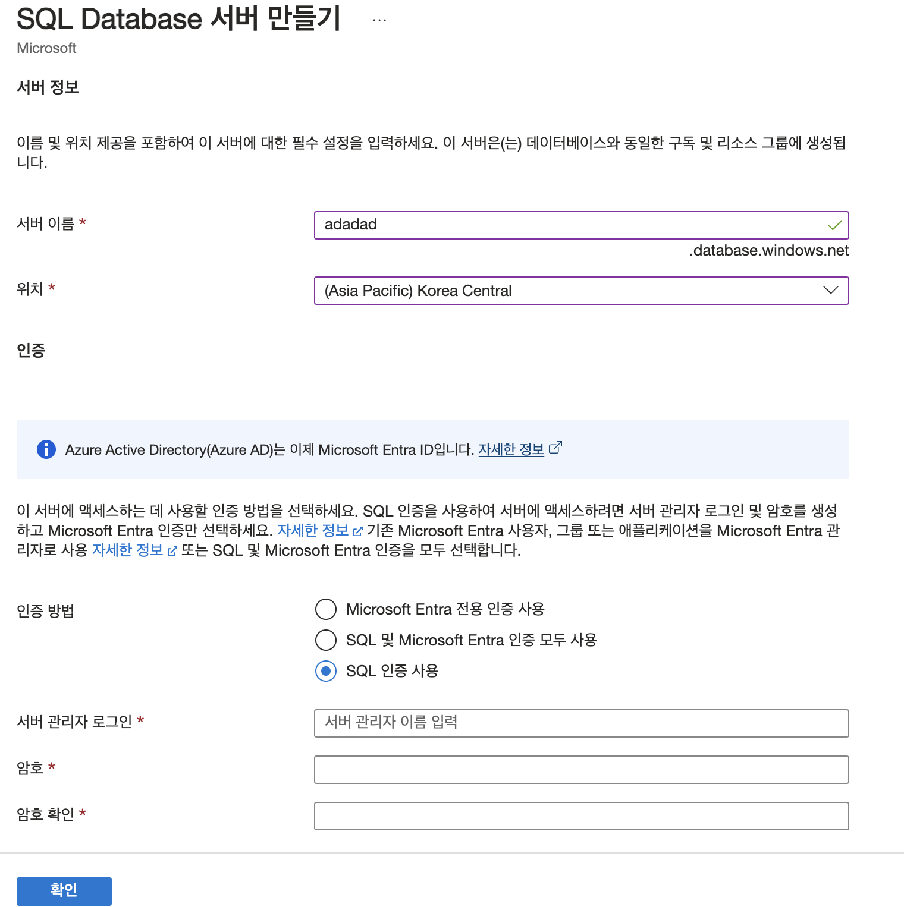
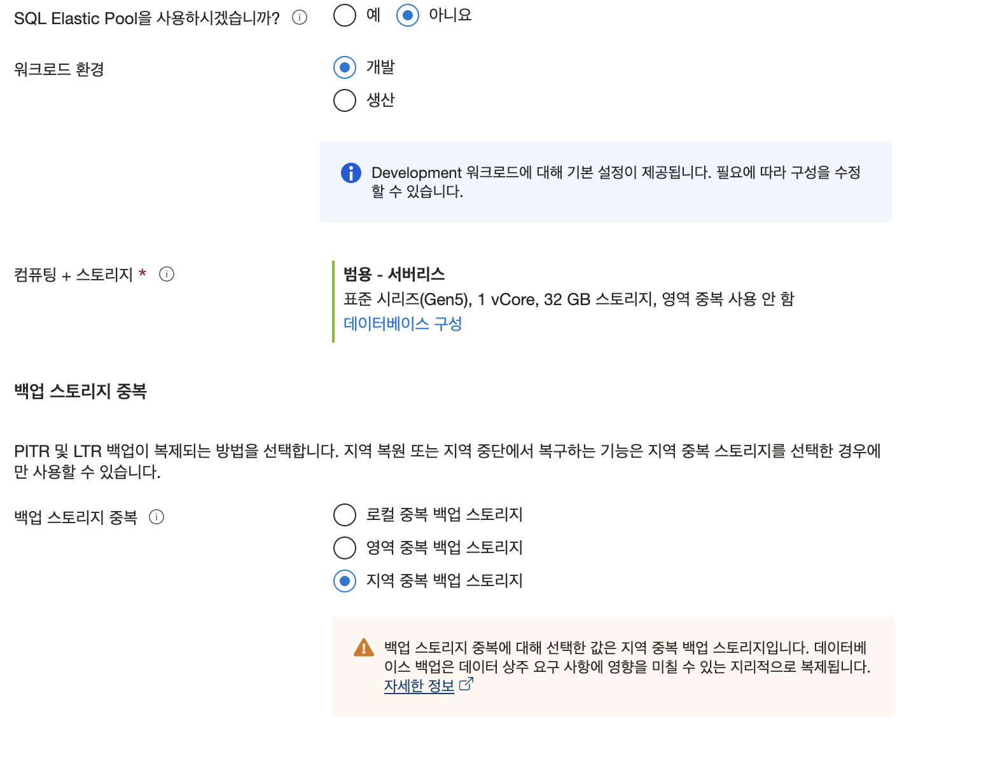
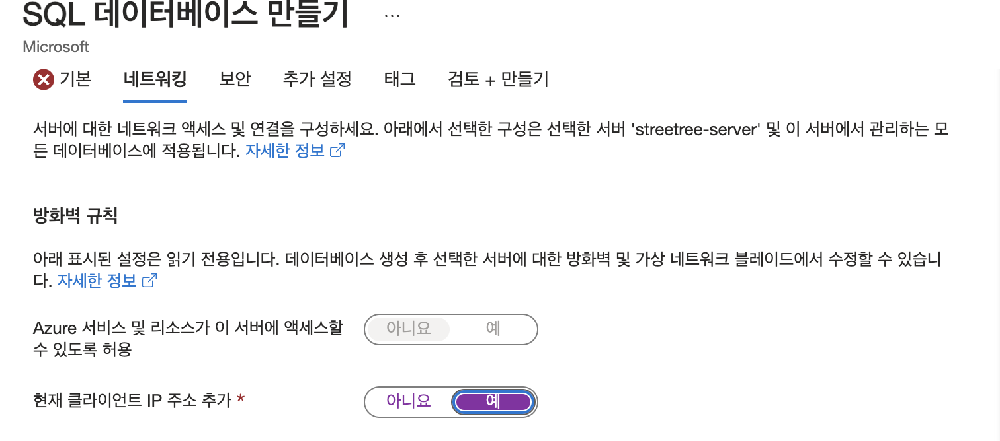
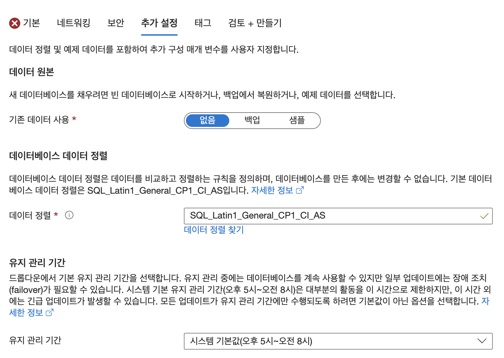
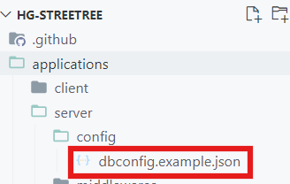

# 가로수 - 농락

해커그라운드 해커톤에 참여하는 가로수 팀의 농락 입니다.

## 참고 문서

> 아래 두 링크는 해커톤에서 앱을 개발하면서 참고할 만한 문서들입니다. 이 문서들에서 언급한 서비스 이외에도 더 많은 서비스들이 PaaS, SaaS, 서버리스 형태로 제공되니 참고하세요.

- [순한맛](./REFERENCES_BASIC.md)
- [매운맛](./REFERENCES_ADVANCED.md)

## 제품/서비스 소개

<!-- 아래 링크는 지우지 마세요 -->
[제품/서비스 소개 보기](TOPIC.md)
<!-- 위 링크는 지우지 마세요 -->

## 오픈 소스 라이센스

<!-- 아래 링크는 지우지 마세요 -->
[오픈소스 라이센스 보기](./LICENSE)
<!-- 위 링크는 지우지 마세요 -->

## 설치 방법

> **아래 제공하는 설치 방법을 통해 심사위원단이 여러분의 제품/서비스를 실제 Microsoft 애저 클라우드에 배포하고 설치할 수 있어야 합니다. 만약 아래 설치 방법대로 따라해서 배포 및 설치가 되지 않을 경우 본선에 진출할 수 없습니다.**

### 사전 준비 사항
- Visual Studio code
- GitHub
    - GitHub Account
    - GitHub CLI
- Azure
    - Azure Account
    - Azure CLI
    - Azure Developer CLI
    - Azure Resource Group
- NodeJS
    - React.js
    - Express.js

## 시작하기
### 환경설정
1. chrome 열기
2. 
 

2.검색란의 visual studio code검색


3.왼측상단에 visual studio code - code editing. Redefined 클릭


4.파란색 버튼안에 Download for Window버튼을 클릭한다 


5. 이렇게 우측 상단에 있는 다운로드 기록을 보면 visual studio code가 다운로드가 되고있음을 볼수있다.


우측상단에 다운로드가 다 되었다고 뜨면 폴더를 클릭하여 다운로드 폴더로 이동한다


이렇게 visual studio code가 다운로드 되있는데 보일것이다
지금 보이는 VScodeUserSetup.exe에다가 마우스 포인터를 갖다댄후 더블클릭을 해준다


그럼 이 화면이 나올텐데 동의합니다(A)를 선택후 사진에는 없지만 다음(next)버튼을 눌러서 넘어간다


그다음은 투가 작업선택창이 나올텐데 처음 보면 밑에 2개만 선택 되있을것이다
여기사ㅓ 우리는 모두 선태하고 이번에도 마찬가지로 사진에는 없지만 다음(next)버튼을 눌러서 넘어간다


이제 그럼 이 화면이 나올텐데 여기서 설치 버튼을 누르면 설치가 진행된다
설치가 완료되ㅣ면 화면 닫기를 누른다


2. 크롬 검색창에 github를 입력한다
3. 
 

밑에 아이콘과 같이 github라고 되있는 것을 클릭한다


여기서 GitHub: Let's build from here · GitHub 이 부분을 클릭한다.


처음 들어가면 이렇게 화면이 보일것이다
여기서 sigh버튼을 누른다
그럼 이렇게 자신의 이메일을 넣는공간이 나올것이다


enter your email밑에


그럼 이렇게 비밀번호를 만드는곳이 생길것이다.
create a password밑에 자신이 원하는 비밀번호를 입력한다


username을 입력하는곳이 나올것이다
enter a username 여기 밑에 입력을 한다


ㄱ
여기에 마지막으로 email을 정보수집 동의를 한다는 체크박스에 표시를 하고 countiue버튼을 누른다

잠시기다리면 로봇이 아닙니다 관련 퀴즈를 풀어야 계정을 생성할수있다

Windows 설치 방법
명령 프롬프트나 PowerShell을 엽니다.

다음 명령어를 입력해 GitHub CLI를 설치합니다:
winget이 설치되지 않은 분들은 https://www.lainyzine.com/ko/article/how-to-install-winget-on-windows-10/
이 링크를 참고하시길 바랍니다.

winget install --id GitHub.cli
설치가 완료되면, 터미널에서 다음 명령어로 GitHub에 로그인합니다:
gh auth login
로그인 과정 중 GitHub.com과 HTTPS를 선택한 후 GitHub 계정 정보를 입력합니다.
macOS 설치 방법
터미널을 열고 다음 명령어를 입력하여 Homebrew를 설치합니다(이미 설치되어 있다면 생략 가능):

/bin/bash -c "$(curl -fsSL https://raw.githubusercontent.com/Homebrew/install/HEAD/install.sh)"
다음 명령어를 입력해 GitHub CLI를 설치합니다:

brew install gh
설치 후, 다음 명령어로 GitHub에 로그인합니다:


gh auth login
결과 확인
로그인이 완료되면, gh auth status 명령어를 실행하여 로그인 상태를 확인합니다. 성공적으로 로그인되었다면, GitHub CLI가 준비된 것입니다.

3. Azure 설정
Azure는 Microsoft의 클라우드 서비스로, 다양한 애플리케이션을 호스팅하고 관리할 수 있습니다. 이 단계에서는 Azure CLI와 Azure Developer CLI를 설치하고 설정합니다.

Azure 계정 생성
Azure 공식 사이트에 접속합니다.
무료로 시작 버튼을 클릭하고, 필요한 정보를 입력하여 계정을 생성합니다.
Azure 계정이 생성되면, Azure 포털에 로그인하여 클라우드 서비스를 관리할 수 있습니다.
Azure CLI 설치
Azure CLI는 Azure 리소스를 명령줄에서 관리할 수 있는 도구입니다. 이 도구를 사용하면 리소스 그룹 생성, 배포, 모니터링 등을 수행할 수 있습니다.

Windows 설치 방법
PowerShell 또는 명령 프롬프트를 열고, 다음 명령어를 실행합니다:


Invoke-WebRequest -Uri https://aka.ms/installazurecliwindows -OutFile .\AzureCLI.msi; Start-Process msiexec.exe -ArgumentList '/I AzureCLI.msi /quiet /norestart' -NoNewWindow -Wait
설치가 완료되면, az --version 명령어를 실행하여 설치가 정상적으로 완료되었는지 확인합니다.

macOS 설치 방법
터미널을 열고, 다음 명령어를 실행합니다:


brew update && brew install azure-cli
설치가 완료되면, az --version 명령어를 실행하여 설치가 정상적으로 완료되었는지 확인합니다.

Azure Developer CLI 설치
Azure Developer CLI는 개발자들이 Azure에서 애플리케이션을 빠르고 쉽게 배포하고 관리할 수 있도록 돕는 도구입니다.

Windows 및 macOS 공통 설치 방법
터미널 또는 PowerShell을 열고, 다음 명령어를 실행합니다:


az extension add --name azure-dev
설치가 완료되면, azd auth login 명령어를 사용하여 Azure Developer CLI에 로그인합니다.

Azure Resource Group 생성
터미널 또는 PowerShell에서 다음 명령어를 사용해 자원 그룹을 생성합니다. 자원 그룹은 Azure에서 리소스들을 묶어서 관리할 수 있게 해주는 단위입니다:


az group create --name myResourceGroup --location eastus
명령어가 성공적으로 실행되면, Azure 포털에서 myResourceGroup이라는 이름의 자원 그룹을 확인할 수 있습니다.

결과 확인
Azure CLI와 Azure Developer CLI가 정상적으로 설치되고, Azure 계정에 로그인된 상태라면 az account show 명령어를 실행하여 계정 정보를 확인할 수 있습니다.

4. Node.js 설치 및 React.js, Express.js 설정
Node.js는 서버 사이드 자바스크립트 환경으로, 웹 애플리케이션 개발에 자주 사용됩니다. React.js와 Express.js는 각각 프론트엔드와 백엔드 개발을 위한 자바스크립트 프레임워크입니다.

Node.js 설치
Node.js 공식 사이트에 접속하여 LTS(Long Term Support) 버전을 다운로드합니다.

운영체제에 맞는 설치 파일을 다운로드한 후 설치를 진행합니다.

설치가 완료되면, 터미널 또는 PowerShell을 열고 다음 명령어를 입력하여 설치된 버전을 확인합니다:


node -v
npm -v
React.js 프로젝트 생성
VS Code를 실행하고, 터미널을 엽니다.

다음 명령어를 입력하여 React.js 프로젝트를 생성합니다:


npx create-react-app my-app
생성된 프로젝트 디렉토리로 이동합니다:


cd my-app
Express.js 프로젝트 생성
VS Code 터미널에서 다음 명령어를 입력하여 Express.js 프로젝트를 생성합니다:


npx express-generator my-express-app
생성된 프로젝트 디렉토리로 이동하고, 필요한 패키지를 설치합니다:


cd my-express-app
npm install
결과 확인
각 프로젝트가 생성되면, npm start 명령어를 실행하여 서버가 정상적으로 실행되는지 확인합니다.

5. VS Code Extensions 설치
VS Code Extensions는 개발 경험을 향상시키기 위해 추가 기능을 제공합니다. GitHub와 Azure와 같은 도구들과 통합할 수 있는 확장 프로그램들을 설치합니다.

설치할 확장 프로그램 목록
GitHub: GitHub와의 통합 기능을 제공합니다.
Azure Tools: Azure 리소스를 관리할 수 있는 확장 프로그램입니다.
ESLint: 코드 스타일을 검사하고 정리하는 도구입니다.
Prettier: 코드 포맷팅 도구로, 코드를 자동으로 정리해줍니다.
확장 프로그램 설치 방법
VS Code를 열고, 좌측의 Extensions 탭(사각형 아이콘)을 클릭합니다.

각각의 확장 프로그램을 검색하여 설치합니다.

예: ESLint를 검색하고, Install 버튼을 클릭합니다.

결과 확인
모든 확장 프로그램이 설치되면, VS Code에서 코드 작성을 시작할 때 각 확장 프로그램의 기능이 작동하는지 확인합니다.

6. Git 및 프로젝트 관리
이 단계에서는 Git을 사용해 프로젝트를 GitHub에 업로드하는 방법을 다룹니다.

GitHub에 프로젝트 업로드
VS Code 터미널에서 아래 명령어를 사용하여 Git 저장소를 초기화합니다:


git init
프로젝트의 모든 파일을 Git에 추가합니다:


git add .
커밋 메시지를 작성하여 변경 사항을 커밋합니다:


git commit -m "Initial commit"
GitHub에 새 저장소를 생성한 후, 이를 원격 저장소로 추가합니다:


git remote add origin https://github.com/{YOUR_USERNAME}/{REPO_NAME}.git
마지막으로, 프로젝트를 GitHub에 푸시합니다:


git push -u origin master
결과 확인
GitHub에 업로드된 프로젝트를 확인하려면, GitHub 사이트에서 해당 저장소로 이동하여 파일들이 정상적으로 업로드되었는지 확인합니다.

## 진짜 시작해봅시다
> 먼저 **hackersground-kr/streetree** 저장소를 자신의 GitHub 계정으로 포크해야합니다.<br>
> <br>
> 우측 상단의 Fork 버튼을 눌러주세요.<br>

> <br>
> 이후 초록색 Create Fork 버튼을 눌러 포크할 수 있습니다.<br>

> 포크된 저장소로 이동한 후<br>
> <br>
> 사진 순서에 따라 포크된 저장소 URL을 복사해줍니다.<br>

> 이후 터미널을 열고 다음 명령을 입력합니다<br>
> ```
> git clone 복사한URL
> cd hg-streetree
> ```
<br>

> 아래 명령을 입력하여 Azure Developer CLI, Azure CLI, GitHub CLI에 로그인합니다.
> ```
> # Azure Developer CLI login
> azd auth login
> 
> # Azure CLI login
> az login
> 
> # GitHub CLI login
> gh auth login
> ```


> 이후 아래 명령을 입력하여 로그인 여부를 확인합니다.<br>
> ```
> # Azure Developer CLI
> azd auth login --check-status
> 
> # Azure CLI
> az account show
> 
> # GitHub CLI
> gh auth status
> ```

> 아래 명령을 입력하여 배포 환경을 설정합니다.
> ```
> # {{ }} 로 감싸진 텍스트는 모두 지우고 자신의(팀의) 깃허브 아이디를 넣어줍니다. <br>
> # Mac
> AZURE_ENV_NAME="{{ GITHUB_ID }}"
> # Windows
> $AZURE_ENV_NAME = "{{ GITHUB_ID }}"
> 
> azd init -e $AZURE_ENV_NAME
> # Use code in the current directory를 선택합니다.
> # Confirm and continue initializing my app를 선택합니다.

> AzureSQL 구축을 위해 https://portal.azure.com/#home에 접속합니다. <br>
>  <br>
> 이후 SQL databases를 클릭해주세요.

>  <br>
> 좌측 상단의 만들기 를 눌러주세요.

>  <br>
> 만들어둔 리소스를 선택해주세요.

>  <br>
> 데이터베이스 이름을 입력 후 밑에 있는 새로 만들기를 클릭합니다.

>  <br>
> 서버 이름 작성 후 위치는 korea central를 선택합니다.
> sql 인증 사용 선택 후 서버 관리자 아이디와 비밀번호를 작성합니다.<br>

> 이전 페이지로 돌아와서 <br>
>  <br>
> 워크로드 환경으로 개발, 백업 스토리지 중복으로는 지역 중복 백업 스토리지를 선택합니다.

>  <br>
> 이후 다음:네트워킹> 을 클릭해주세요.

>  <br>
> 현재 클라이언트 IP 주소 추가를 예로 변경합니다.

>  <br>
> 추가 설정 탭에서 기존 데이터 사용을 없음으로 설정합니다.

>  <br>
> 마지막으로 검토 + 만들기를 선택해줍니다.

> 다시 로컬 저장소 디렉토리를 열어줍니다. <br>
>  <br>
> `hg-streetree/applications/server/config/dbconfig.example.json` 파일을 열어줍니다.
> ```
> {
>     "user": "{{ AZDB_USERNAME }}",
>     "password": "{{ AZDB_PASSWORD }}",
>     "server": "{{ AZDB_SERVER }}",
>     "database": "{{ AZDB_DATABASE }}"
> }
> ```
> `{{ }}`로 감싸진 필드를 전부 알맞은 값으로 바꿔주세요. <br>
> `{{ AZDB_USERNAME }}`: AzureSQL의 사용자 이름<br>
> `{{ AZDB_PASSWORD }}`: AzureSQL의 사용자 패스워드<br>
> `{{ AZDB_SERVER }}`: AzureSQL의 서버 이름<br>
> `{{ AZDB_DATABASE }}`: AzureSQL의 데이터베이스 이름<br>
> 이후 파일명을 `dbconfig.example.json`에서 `dbconfig.json`로 바꿔주면 됩니다.


## 애져 배포
>  <br>
> Use code in the current directory을 선택해줍니다.

> 한번더 엔터를 누른후
> 포트를 적으라고하면 80을 치고 엔터
> 한번 더 적으라고 하면 3000을 치고 엔터를 합니다.
> 그리고 streetree를 적고 엔터를 합니다.
> 다 한 뒤에 azd up을 하면 됩니다.

> 지역은 koreacentral을 선택합니다
> 리소스 그룹을 물으면 rg-streetree를 치고 엔터를 누릅니다.

> 애져사이트의 리소스그룹에 올라온걸 확인할 수 있습니다.
>
