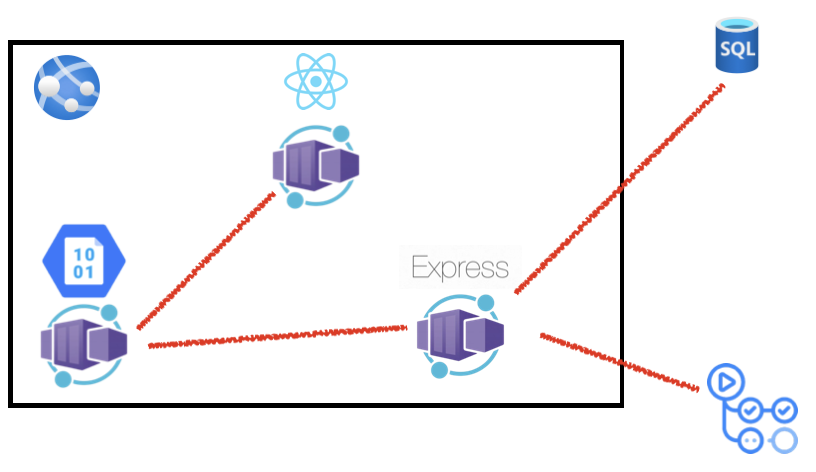

# 가로수 팀 해커톤 주제

## 팀명

가로수

## 제품명

농락

## 참가 동기

2024 해커그라운드 인의성에 참가하게 된 이유는 Azure라는 클라우드 기술과 의성을 위한 아이디어를 직접 생각해보고, 팀원들과 지식과 경험을 나누며 저희의 경험을 쌓기 위해서입니다. 빠르게 변화하는 IT 환경에서 더 나은 기술적 문제 해결 능력을 키우고, 협업을 통해 창의적인 해결책을 생각하며, 앞으로 진로 발전에 큰 도움이 될 것이라 확신하기 때문입니다.

## 주요 기능 및 특징, 기대 효과

농업 체험 예약
체험 목록: 의성 지역의 다양한 농업 체험 활동(예: 농작물 수확, 농사 체험, 전통 농업 기법 등)
예약 시스템: 날짜와 시간 선택 후 예약 가능
체험 상세 정보: 체험 내용, 준비물, 유의사항 등
결제 시스템: 체험료 결제 및 환불 주의사항 안내
자원 봉사 활동
봉사 목록: 지역 사회와 연계된 다양한 봉사 활동(예: 농사 재능 기부, 환경 보호 활동 등)
봉사 신청: 봉사 활동 예약 및 신청
봉사 기록: 참여한 봉사 활동 기록 및 인증서 발급
사용자 리뷰 및 평가
체험 리뷰: 사용자가 체험 후 남기는 리뷰 및 평점
봉사 활동 리뷰: 봉사자와 활동에 대한 피드백
커뮤니티 소통
Q&A: 체험자 및 자원 봉사자 간의 정보 교환 및 질문 응답
공지사항: 업데이트 내용
AI 기능 :문의 답변
        비속어 필터
        리뷰해석
        적합성성
청년 귀농 프로그램
청년 농업 체험: 20대에서 30대 청년층을 위한 특별 농업 체험 프로그램(예: 농업 기본 교육, 농작물 재배 기술 등)
농가 연결: 청년들이 농가와 직접 연락하고 협력하여 농업 기술을 배우는 기회 제공
멘토 시스템: 경험이 많은 농업인과의 멘토링
주거 지원: 농촌 지역에서의 주거 및 생활 지원 정보 제공
청년 농업자금: 농업 관련 자금 지원 및 창업 지원 정보 제공

이로써 이 기능으로 보이는 기대효과는 지역 농업 활성화와 경제 성장을 도우며, 청년 귀농 프로그램을 통해 농촌 인구 유입을 늘리며, 농업 기술의 확산과 혁신을 지원할수있습니다. 자원봉사 활동으로 지역의 이웃들과 가까워지며, 사용자 리뷰와 AI 기능을 통해 체험과 봉사 프로그램의 질을 지속적으로 개선하여 만족도를 높일 수 있습니다. 또한, 청년층의 농촌 정착을 지원함으로써 농업 창업과 귀농을 촉진하고, 농촌 사회의 지속 가능성을 높일 수 있습니다.

## 제품 아키텍처 (이미지)

## 제품 소개 슬라이드

**(필수)** 제품 또는 서비스를 소개하는 슬라이드 덱을 리포지토리에 추가해 주세요. 슬라이드 덱은 [decks](./decks) 디렉토리에 저장한 후 이곳에 링크를 걸어주세요.

## 제품 소개 동영상

제품 또는 서비스를 소개하는 동영상을 YouTube와 같은 곳에 업로드하고 동영상 링크를 적어주세요.
